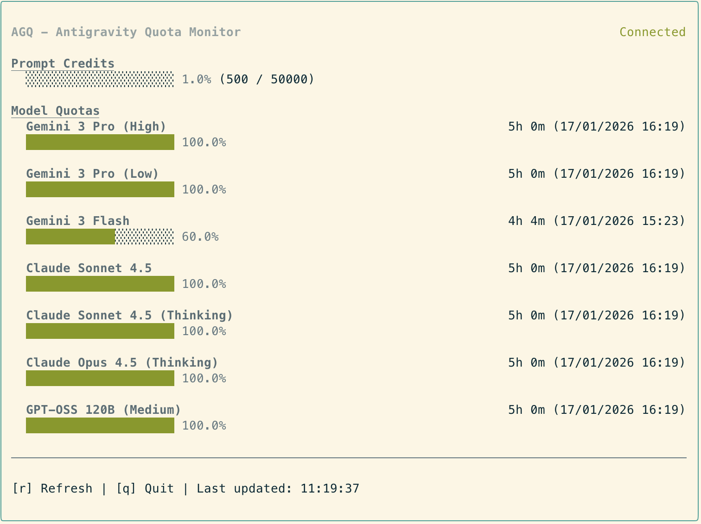

# Antigravity Quota (AGQ) - TUI

A standalone terminal-based dashboard (TUI) that monitors your Antigravity AI model usage quota in real-time.



## ⚠️ Important Requirement

**Antigravity IDE must be running.**

This tool works by connecting to the internal language server managed by the Antigravity IDE. It "borrows" the active session and security tokens to provide you with live data. If the IDE is closed, the language server process terminates, and this tool will wait until it is reopened.

## Features

### 📊 Real-Time TUI Dashboard
- **Live Monitoring** – Beautiful terminal interface built with Ink (React for CLI).
- **Visual Progress Bars** – Color-coded indicators (Green/Yellow/Red) for remaining quotas.
- **Model Tracking** – See usage details and time until reset for all models (Claude, GPT, Gemini, etc.).
- **Prompt Credits** – Track your available monthly prompt credits at a glance.

### 🔍 Zero Configuration
- **Automatic Process Detection** – Finds Antigravity's language server, port, and auth token automatically.
- **Background Polling** – Keeps your data fresh without manual intervention.

### 💻 Cross-Platform Support
- **Windows** – Support using PowerShell/CIM for process detection.
- **macOS** – Unix-based detection strategy.
- **Linux** – Unix-based detection strategy.

## Installation

```bash
# Clone the repository
git clone https://github.com/Henrik-3/AntigravityQuota.git
cd AntigravityQuota

# Install dependencies
npm install

# Build the project
npm run build
```

## Usage

Start the dashboard:
```bash
npm start
```

Or run directly from the export:
```bash
node export/index.js
```

### CLI Options
- `-i, --interval <number>`: Set the polling interval in seconds (default: 120).
- `-h, --help`: Display help.

### Controls
- `r`: Force a manual refresh or attempt to reconnect.
- `q`: Quit the application.

## Configuration

You can also configure the application using environment variables:

| Variable | Default | Description |
| -------- | ------- | ----------- |
| `AGQ_POLLING_INTERVAL` | `120` | Polling interval in seconds |
| `AGQ_ENABLED` | `true` | Set to `false` to disable monitoring |
| `AGQ_SHOW_CREDITS` | `false` | Set to `true` to show prompt credits by default |

## How It Works

1. **Process Detection** – Scans your system for the active Antigravity language server process.
2. **Session Borrowing** – Extracts the required connection parameters (ports, CSRF tokens) from the running process arguments.
3. **Local Communication** – Communicates directly with the local language server to retrieve model quotas and plan status.
4. **TUI Rendering** – Uses React/Ink to render a clean, interactive dashboard in your terminal.

## Development

```bash
# Watch mode (automatically rebuilds on change)
npm run dev

# Lint
npm run lint
```

## Disclaimer

This project was built to provide a standalone alternative to the VS Code extension. 
Some parts of the detection logic are inspired by the [Antigravity Quota Watcher](https://github.com/wusimpl/AntigravityQuotaWatcher) project.

This project is not endorsed by Google and doesn't reflect the views or opinions of Google or anyone officially involved in producing or managing Google/AntiGravity properties.

## License

[MIT License](LICENSE)
